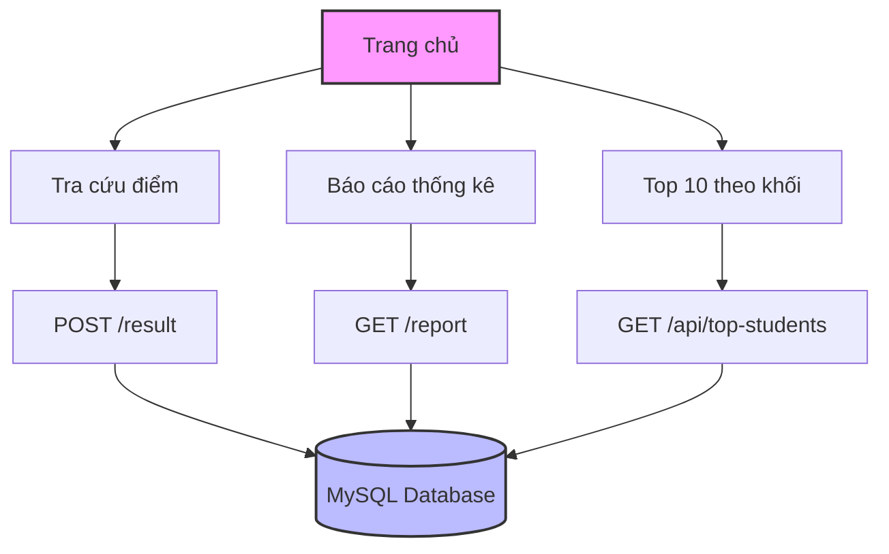

# Hệ thống Tra cứu và Phân tích Điểm thi THPT Quốc gia


Hệ thống web cho phép tra cứu điểm thi THPT Quốc gia, phân tích thống kê và xếp hạng học sinh theo khối thi. Được phát triển bởi [Nguyễn Văn Mạnh](https://vanmanh-dev.id.vn/).

## 🌟 Tính năng chính

1. **Tra cứu điểm thi**
   - Tìm kiếm theo số báo danh
   - Hiển thị điểm chi tiết 10 môn học
   - Giao diện thân thiện, dễ sử dụng

2. **Phân tích và Thống kê**
   - Biểu đồ phân loại điểm theo 4 mức:
     * Giỏi: >= 8.0 điểm
     * Khá: 6.0 - 7.99 điểm
     * Trung bình: 4.0 - 5.99 điểm
     * Yếu: < 4.0 điểm
   - Có thể xem thống kê theo từng môn hoặc tổng quan
   - Biểu đồ trực quan, dễ hiểu

3. **Top 10 theo Khối**
   - Hỗ trợ đầy đủ các khối thi phổ biến:
     * Khối A: A00, A01, A02,...
     * Khối B: B00, B01, B02,...
     * Khối C: C00, C01, C02,...
     * Khối D: D01, D07, D08,...
   - Tính tổng điểm và xếp hạng tự động
   - Tìm kiếm khối thi nhanh chóng

## 🔄 Luồng hoạt động



## 🚀 Cài đặt và Chạy

### Yêu cầu hệ thống
- Docker và Docker Compose
- hoặc Python 3.9+

### Chạy với Docker

```bash
# Clone repository
git clone <repository-url>
cd <project-directory>

# Build và chạy
docker-compose up --build

# Truy cập ứng dụng tại http://localhost:5000
```

### Chạy trực tiếp

```bash
# Tạo môi trường ảo
python -m venv venv
source venv/bin/activate  # Linux/Mac
venv\Scripts\activate     # Windows

# Cài đặt dependencies
pip install -r requirements.txt

# Chạy ứng dụng
python app.py
```

## 📡 API Endpoints

### 1. Tra cứu điểm
```http
POST /result
Content-Type: application/x-www-form-urlencoded

sbd=<số báo danh>
```

### 2. Báo cáo thống kê
```http
GET /report?subject=<mã môn học>
```
Params:
- subject: all (mặc định), toan, ngu_van, ...

### 3. Top 10 theo khối
```http
GET /api/top-students?block=<mã khối>
```
Params:
- block: A00, A01, B00, ...
## 📂 Cấu trúc Project

```
project/
├── app.py                 # Flask application chính
├── requirements.txt       # Dependencies
├── Dockerfile            # Docker config
├── docker-compose.yml    # Docker Compose config
├── static/
│   └── style.css         # CSS styles
├── templates/
│   ├── index.html        # Trang chủ
│   ├── report.html       # Trang báo cáo
│   └── top_students.html # Trang top 10
└── models/
    └── subject_manager.py # Quản lý môn học & khối thi
```

## 💻 Công nghệ sử dụng

### Backend
- **Python Flask**: Web framework
- **PyMySQL**: Kết nối MySQL database
- **Matplotlib**: Tạo biểu đồ thống kê

### Frontend
- **Bootstrap 4**: Framework CSS
- **jQuery**: JavaScript library
- **Select2**: Enhanced select boxes
- **Font Awesome**: Icon library

### Database
- **MySQL**: Lưu trữ dữ liệu điểm thi

### DevOps
- **Docker**: Containerization
- **Docker Compose**: Container orchestration

## 👨‍💻 Tác giả

**Nguyễn Văn Mạnh**
- 🌐 Website: [https://vanmanh-dev.id.vn/](https://vanmanh-dev.id.vn/)
- 💼 Kỹ sư phần mềm tại TP. Hồ Chí Minh
- 🎯 Chuyên môn: Web Development, Software Engineering


---
Developed with ❤️ by Nguyễn Văn Mạnh
```
